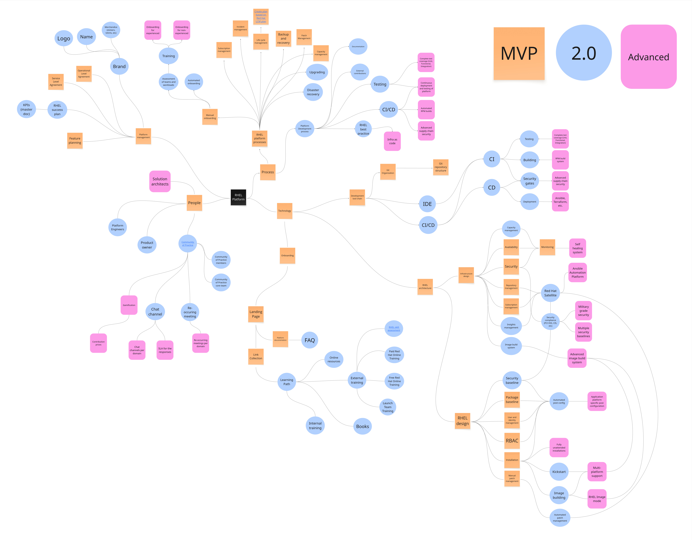

# What is an operational model?

Hello and welcome. This is a good practice based operational model for Red Hat Enterprise Linux. This model is for people who wants inspiration for how you can run and manage a Linux standard platform based on Red Hat Enterprise Linux.

This model covers good practices and should not be read as a list of things you always need to do. Different organizations are different.

The model, which covers people, process, technology, service management and strategy is divided between three different advancement levels (1-3). Access these different levels via the menu on the top of this page.

It’s likely that your best fit is a mix of the different levels (MVP, 2.0, Advanced).

An overview of the complete operational model, with all sub-sections can be viewed below. Zoom into the picture for details:

1. Minimal Viable Product (MVP)

The MVP version of a platform definition is a common good practice starting point, which we can build on. Due to the limitation in regards to automation, this works for a limited install base of servers. We are weighing things such as ease-of-adoption and standardization against effort to implement. Instead of creating a so-called “big bang release”, which requires significant investments in regards to effort and people, we ensure we have just enough platform features to provide our platform for some first real life use-cases.

[Read more here.](https://redhat-cop.github.io/rhel-good-practices/operational-model/mvp/)

2. Two point zero (2.0)

Once there has been some real degree of success and adoption of the platform, it’s time to fine tune the definition for it to be able to meet the requirements of the future. Focus is on more advanced platform and adoption related capabilities. We spend more time standardizing things such as how we develop, install and configuration the platform, an investment which is required as the burden of compliance otherwise threatens to grind our organization to a halt. The features we now build reduces the effort regarding maintenance and compliance, and allows us to maintain a much larger install base of Linux installation.

[Read more here.](https://redhat-cop.github.io/rhel-good-practices/operational-model/twozero/)
3. Advanced

A lot of focus now goes into making sure the platform install base can grow to significant scales and make more signficant business impact. Our platform is one of the key technologies used in our organization and needs to be able to cater for much stricter requirements. At the same time we need to spend increased effort on the community we have built around our Linux platform. Some final technical capabilities are put in place to ensure we can meet any type of business requirements.

[Read more here.](https://redhat-cop.github.io/rhel-good-practices/operational-model/advanced/)
