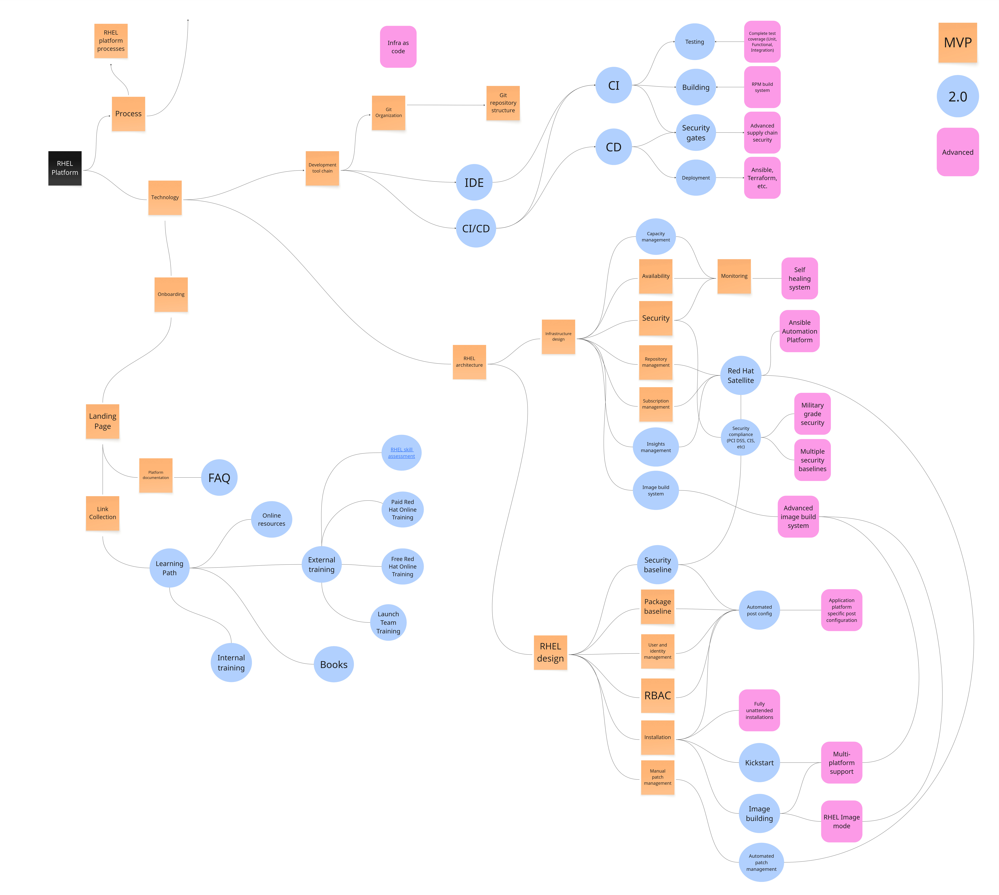

# Operational Model - RHEL - Minimal Viable Product
If you are wonder what an operational model is, [you should start by reading this introduction](intro.md).

# People
Overview of the people section. Zoom into this picture for details.

* It is common that the people who operate and maintain the platform has other jobs and do not work dedicated on the platform. Or it could simply just be a group of people with system admin type jobs. Even though we do not yet require a dedicated platform owner or platform engineering team, we should already start thinking about that.

# Process
Overview of the process section. Zoom into this picture for details.

## RHEL Platform processes
Processes related to the Red Hat Enterprise Linux standard platform itself.

* **Incident management** - We need a standard process for managing technical incidents for the platform. Who should people contact if something goes wrong with their Linux server? And what will we do if something breaks?
* **Life Cycle Management** - It is important that we communicate when we plan to update our platform. This in a form of a life-cycle management plan. At this point, if you do not know much about this, you can copy the Red Hat Enterprise Linux life-cycle management plan, which you find here: [Red Hat Enterprise Linux Life Cycle](https://access.redhat.com/support/policy/updates/errata)
* **Backup and recovery** - We need to have a standard process for doing backups and recovering from those backups. Life cycle management and incident management depends on this.
* **Patch Management** - We need a process for how to patch our RHEL installations. This can include moving between minor releases of RHEL, but not major releases as that is a special workflow. In part this process needs to cover how you identify systems which needs to be patched and then how the system is patched. Initially, this will be a manual process, later on, this becomes an automated process.
* **Capacity management** - How do we monitor the utilization of an installed RHEL server, and act as we need to expand the capacity? Put in place a process to deal with this. It's normal that the process at this point is manual.
* **Subscription management** - How do you keep track of your Red Hat Enterprise Linux subscription usage? If your systems can conntact to Red Hat's services, then you will be able to manage your subscriptions via [Red Hat's online Subscription Management page](https://access.redhat.com/management). You should create a process for keeping track of utilization, so that you can order more subscriptions, before you actually run out. You can reach out to your Red Hat account team to get help with designing such a process.

## Onboarding process
* **Manual onboarding** - The onboarding process is commonly not automated. When new people or teams get onboarded, the people who works with the platform are responsible for this process. This process is very simple in its nature, lacking assessment of who and what is onboarded and training. Because of this - what people end up doing with their systems, and how they will manage them, is very different. If you need to onboard more than a few teams, you should have more advanced.

An overview of a common onboarding process can be viewed below. Please note that the graphics describes all three advancement levels of onboarding.

The steps for the MVP version of the onboarding process follows:

* **Users provided access to landing page** - The landing page is referenced and described in the overall operational model. It is a page where users can go and get information such as platform documentation, descriptions of process (such as the onboarding process itself) and documentation and training materials/links.
* **LDAP groups created** - If your organization is using an LDAP solution for identity, create some standard LDAP groups which you can connect to the your RHEL installations. It's good if you create some type of standard naming here, such as: rhel-(system-name)-(team name)-admin, rhel-(system-name)-(team name)-user, etc. The team in question can then own these groups and do user management themselves.
* **Users added to group** - Users are added to the groups in question. This may be done by the team who are being onboarded.
* **RBAC configuration created on servers** - You now put in place the required RBAC related configuration on your server, as it relates to things such as sudoers, ssh, pam, sssd, etc. 

## Development processes
* There are no standardized processes yet, related to how we are developing our RHEL platform. That also puts some limitations for how much we can scale at this point, as that would risk racking up a lot of technical debt. As an example, if we have to perform a lot of changes to our RHEL standard, that will take a lot of time and effort, while it's likely that those changes will not be applied consistently across our installed base.

# Technology
Overview of the technology section. Zoom into this picture for details.

## RHEL architecture
Architectural decisions related to Red Hat Enterprise Linux.

### Infrastructure design
Infrastructure related decisions.

* **Availability** - We need to design our platform so that it can meet our requirements for availability. That may mean that we need to support to run on a specific server or virtualization platform, or support specific storage configurations related to SAN.
* **Security** - We need to design our platform so that it also meets requirements for security, that includes hardening practices for RHEL, supporting network segmentation, 3rd party security tools, etc.
* **Monitoring** - To ensure availability and security, some type of monitoring needs to be put in place. How do you know if utilization of CPU, memory or storage goes through the roof? How do you know that your backup client or security related services are running? Monitoring.
* **Repository management** - If your systems can connect to Red Hat's YUM repositories, then this item is resolved. Please note that when you do update your systems, they will be updated to whatever latest versions are available. If you want control over what version of software gets installed on your RHEL servers, or if your systems cannot be connected to Red Hat provided YUM repositories, then you need to decide how you will manage the RHEL yum repositories yourself. Via some 3rd party system or by simply synchronizing related repositories to some local NFS or HTTP server?
* **Subscription management** - If your systems can conntact to Red Hat's services, then you will be able to manage your subscriptions via [Red Hat's online Subscription Management page](https://access.redhat.com/management). If this is not the case, you should invent some custom temporary mean to count how many subscriptions are currently used, perhaps by development a document for this purpose.

### RHEL design
Design of your Red Hat Enterprise Linux standard.

* **Package baseline** - You have to decide what packages should be a part of your RHEL standard installation. Red Hat has some standard RHEL package definitions such as core, base, which can inspire you. Also, if you have a look at a standard RHEL KVM or Cloud images, that can also be used for inspiration.
* **User and identity management** - How will you do users management in your RHEL standard? Will you allow the use of local users? Will you require the use of some LDAP service for identity and authentication? Will you mandate the use of service accounts for automation? You better decide these things now, before you have hundreds of servers.
* **RBAC** - This relates to configuring who gets access to do what. Will everyone have root access? Or will only some people have this? This is where you decide on any separation of duty enforcements and configure related services such as sssd, sshd, sudoers, pam, etc.
* **Installation** - Decide on how to install Red Hat Enterprise Linux. Starting off with your RHEL Linux standard platform, it is not unusual that people manually installs RHEL. With that said, nowdays it's also common that you start off with some automated installation, using standard RHEL images you download and built in virtualization or cloud features such as cloud init.
* **Manual patch management** - In the beginning of your RHEL journey, it's not uncommon that patch management is a manual process. You still need to decide on how to do patching though. This includes the process of making patches available to your systems, ensuring backups are in place, installing updates, testing so that nothing broke, etc. If this process is not automated it soon becomes very painful to scale the numbers of your installed based of RHEL. So prioritize automating this later on.

## Development tool chain
Features related to the development tool chain.

* **Git organization** - How do you organize things such as related automation, in your version control system? Do you gather all repositories in the same group, or something else?
* **Git repository structure** - If you end up maintaining a lot of different respositories, it may be a good idea to decide how these repositories should work. Will you commit everything straight to the main branch, or will you have [a more refined git branching strategy](https://www.gitkraken.com/learn/git/best-practices/git-branch-strategy)?

## Onboarding
Technology implementations related to onboarding.

* **Landing page** - When someone gets onboarded to your platform. They need a place to start their onboarding process. This is typically a wiki page or webpage maintained by the core platform team.
* **Platform documentation** - A common part of a technical platform implementation, you have documentation which decribes to other people how the platform works.
* **Link collection** - A good way to help people who get onboarded is by maintaining a list of useful links.

# Platform management 
Overview of the platform management section. Zoom into this picture for details.

Administrative features which helps with the development or maintenence of the platform.

* **Service Level Agreement** - Select what different SLAs your platform should support.
* **Operational Level Agreement** - Select what different OLAs your platform should support (if you use OLAs).
* **Feature planning** - Make sure that as you plan and prioritize the different capabilities of your platform. A good start is to benchmark yourself against the model and then prioritize the different features across the MVP, 2.0 and Advanced levels. Except for creating more structure for the platform building process - this allows you to communicate detailed information about future feature, to the users of the platform.
